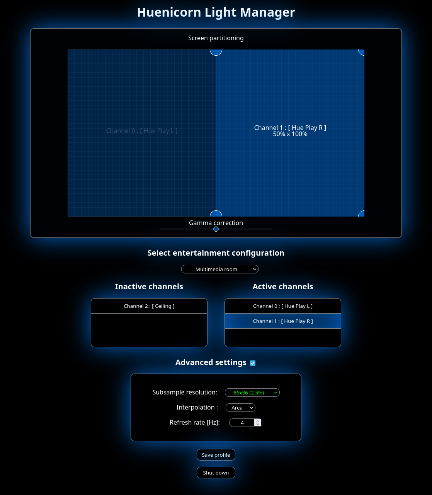

# Huenicorn

A free Philips Hue™ screen synchronizer for Gnu/Linux

## Description

Huenicorn is a free ambilight driver for Gnu/Linux.
In other words, Huenicorn allows you to extend the colorful atmosphere of your computer screen to your Hue light bulbs in real-time.
Huenicorn provides a simple web interface to assign specific portions of screen to the light bulbs you desire and save the settings for a further entertainment session.

### Screenshot

|  |
|:--:|
| *Caption: Huenicorn Light Manager user interface* |

## Project status

Huenicorn 1.0.3 is available.

This revision brings

* Switch Mbed-TLS to new major version

## Getting Started

* Before using Huenicorn, you need to define some entertainment area on your Hue bridge through the official application provided by Philips.

### Requirements

* Gnu/Linux system running X11 graphics session
* Philips Hue bridge with registered lamps

### Dependencies

* X11
* [OpenCV](https://github.com/opencv/opencv)
* [CurlPP](https://github.com/jpbarrette/curlpp)
* [Restbed](https://github.com/Corvusoft/restbed)
* [Mbed-TLS](https://github.com/Mbed-TLS/mbedtls)
* [GLM](https://github.com/g-truc/glm)

### Compiling Huenicorn

Make sure the abovementionned libraries are installed (preferably through your system's package manager)

```bash
git clone https://gitlab.com/openjowelsofts/huenicorn.git
cd huenicorn
mkdir build && cd build
cmake ..
make
```

The output is a standalone executable called "huenicorn".
When running Huenicorn, make sure that the ```webroot``` directory is in the cwd (current working directory).

### Executing program

* Run the executable named "huenicorn" in the way you prefer (Terminal if you want some text feedback)
* Open your favorite web browser at [127.0.0.1:8080](http://127.0.0.1:8080)
Browser will spawn automatically for the initial setup and as long as no light profile has been saved
(Service port can be edited in configuration. Default is 8080)

#### Initial setup

When executed for the first time, Huenicorn spawns the setup page in your favorite browser. It consists of a step-by-step wizard to locate your Hue bridge on the network and register an user on it.

Upon setup proper setup termination, Huenicorn will resume in its ordinary execution workflow.

The webpage can then be refreshed to reach the Light Manager interface.

#### Ordinary execution worflow

At startup, Huenicorn will look for a saved profile and start its color streaming execution.

If you want to assign lights to some portions of your screen, open the web interface and drag'n'drop the available lights from the left list to the right one.

When a synced light is selected in the list, its portion of allocated screen can be adjusted in the screen partitioning section.

Once you are satisfied with the layout, you can save it as a profile and it will be automatically reloaded for further executions.

As long as no profile has been saved, light management interface will spawn automatically at startup.

### Configuration files

The configuration files can be found in your home directory at ~/.config/huenicorn/
config.json contains the bridge-related configuration.
profile.json contains the saved channels geometry for an entertainment configuration.

The data structure of these files is JSON.

#### config.json

  This file contains some parameters that can be manually edited after initial setup.

* **boundBackendIP**:  (String) IP address to bind the service on
* **bridgeAddress**:  (String) Address of the Philips Hue bridge
* **credentials**:
  * **clientkey**: (String) 32 hexadecimal characters key provided by initial setup
  * **username**: (String) Base64 or UUID username provided by initial setup
* **profile**:  (String) Name of the current user-defined light profile
* **refreshRate**:  (Unsigned) Screen capture and light update frequency
* **restServerPort**:  (Unsigned) Port on which the web UI must respond
* **subsampleWidth**:  (Unsigned) Width of the treated image subsample

#### profile.json

This file contains a list of channels related to an entertainment configuration.

* **Channels**: (Array) List of entertainment configuration channels
  * **active**: (Boolean) whether the channel is active or not
  * **channelId**: (Unsigned) Index of the channel in the entertainment configuration
  * **devices**: (Object) List of devices for the channel
    * **id**: (String) UUID of the device
    * **name**: (String) User-defined name of the device
    * **id**: (String) Manufacturer-defined name of the device
  * **gammaFactor**: (Float) Light brightness modifier
  * **uvs**: (Object) Pair of coorinates for sub image treatment
    * **uvA**: (Object) Top-left corner coordinate
      * **x**: (Float) x coordinate
      * **y**: (Float) y coordinate
    * **uvB**: (Object) Bottom-reft corner coordinate
      * **x**: (Float) x coordinate
      * **y**: (Float) y coordinate
* **entertainmentConfigurationId**: (String) UUID of the related entertainment configuration

#### Shutting down

Huenicorn can be shut down through the web interface or by sending a termination signal.

## Website

Additionnal information and news can be found on [Huenicorn.org](http://huenicorn.org), the official website of the project.

## Version history
* 1.0.3
- * Moving to Mbed-TLS 3.4
* 1.0.2
  * Performance improvement
* 1.0.1
  * Better reliability and documentation
* 1.0.0
  * First stable release
* 0.0.0 (Legacy)
  * Initial (slow) implementation using Hue HTTP API

## Authors

OpenJowel

## License

Huenicorn is licensed under the GNU GPLv3 License. see the [LICENSE.txt](LICENSE.txt) file for details.

## Acknowledgments

* [RGB D65 conversion](https://gist.github.com/popcorn245/30afa0f98eea1c2fd34d)
* [Huestacean](https://github.com/BradyBrenot/huestacean)
